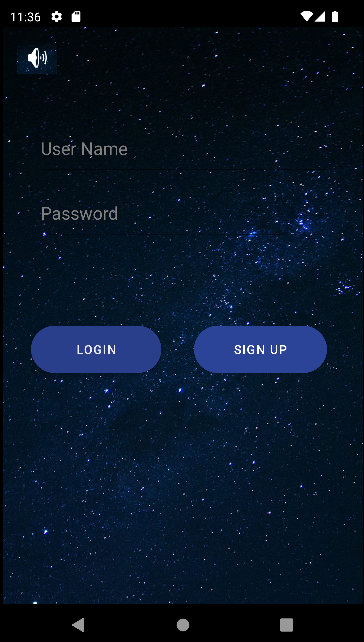
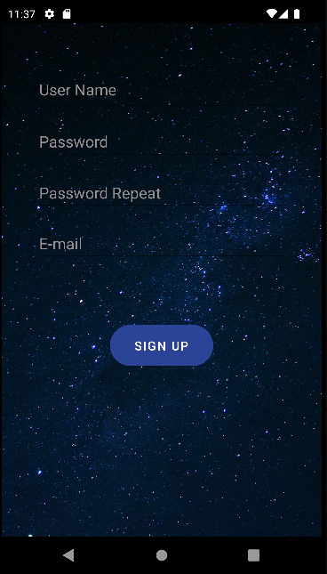

# Memory-Card-Game

Kotlin ile Harry Potter temalı bir hafıza oyunu

- Hafıza Oyunumuzda kolay, orta ve zor olamk üzere 3 modumuz var. Bunun yanında single ve multi player modlarımızda bulunmakta. Yani totalde 6 farklı oyun seçeneği bulunmakta.
- Oyunun mantığı verilen süre içinde aynı kartları bulabilmek. 
- Her kartın kendine ait bir puanı ve evi var o evlerinde kendine ait puanları var. Her kart açıldığunda Puan hesaplama işlemi sürede baz alınarak hesaplanıyor.   

**Proje Kotlin ile yazıldı Cloud Database olarak Firebase kullanıldı. Kullanıcılar anlık olarak kayıt olup giriş yapabiliyor.**

  

