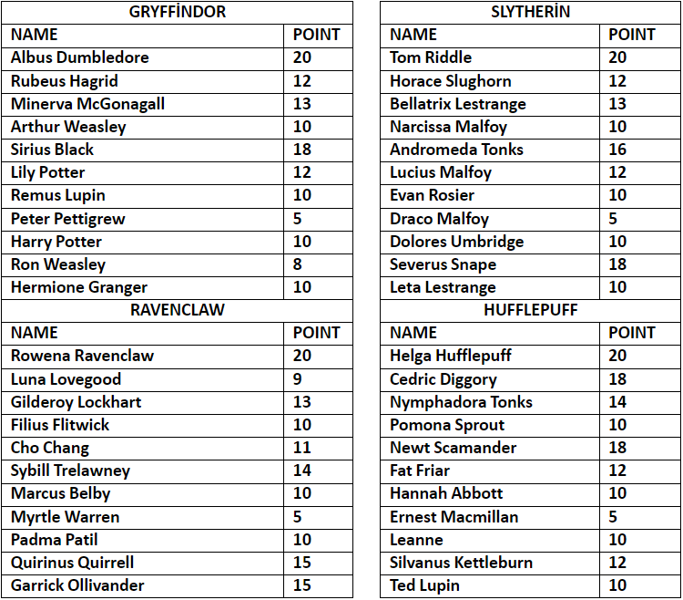
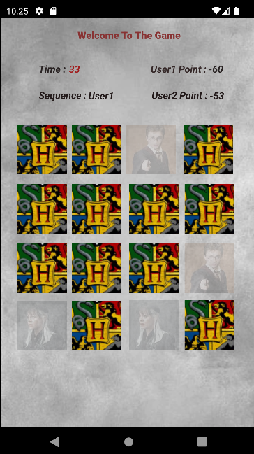

# Memory-Card-Game

Harry Potter themed memory game with Kotlin.

- We have 3 difficulty modes in our memory game. They are easy, medium, and hard modes. There are single and multiplayer game options.
- The game's logic is to match the same cards within the given time and gain as much as possible. 
- Each card has its point and belongs to a house. Each house has its points. Each time a card is opened, the point calculation process is calculated based on time.

**The project is written in Kotlin and Firebase is used as a Cloud Database.**

  
 

# How to operate?
it is necessary to pull the project locally and run the cardGame file in Android Studio.
